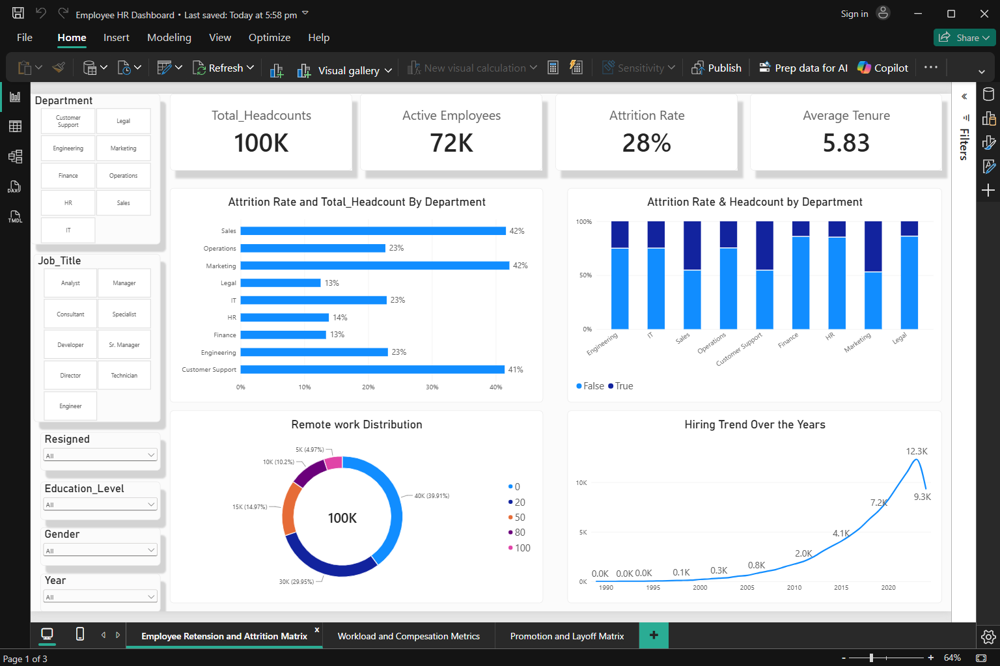
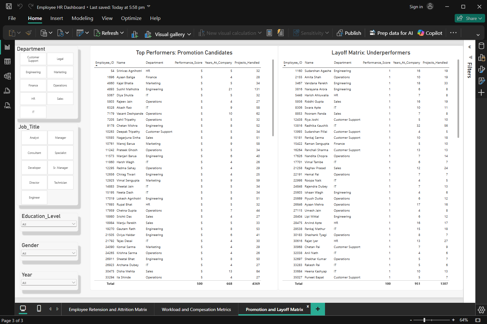
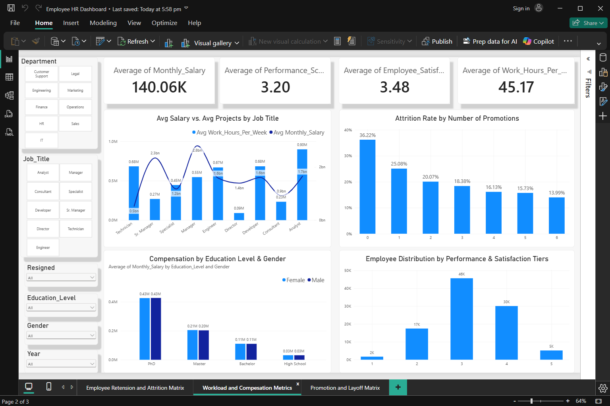

# 📊 Enterprise Workforce & HR Analytics: End-to-End Case Study
**Evaluating Workforce Retention, Compensation Equity, Remote Work Efficacy, and Talent Optimization Across 100,000 Employees**

## 🛠️ Tech Stack
* **Python:** Pandas, NumPy, Matplotlib Data Imputation, Cleaning, Exploratory Data Analysis ([Employee HR Dataset Python problems.ipynb](Python Notebooks/Employee HR Dataset Python problems.ipynb))
* **SQL:** MySQL: Aggregations, Window Functions, CTEs, View Creation ([HR dataset SQL Problems.sql](SQL Scripts/HR dataset SQL Problems.sql))
* **Data Visualization:** Microsoft Power BI ([Employee HR Dashboard.pbix](Dashboard/Employee HR Dashboard.pbix))

## 📌 Executive Summary & Project Objective
High employee turnover and misaligned compensation structures silently erode enterprise profitability. This project analyzes a comprehensive 100,000-employee Indian HR dataset spanning 9 departments and 9 job titles (hiring records from 1989–2025) to uncover actionable drivers of attrition, workload distribution, and performance.
To demonstrate full-stack data analytics capabilities, this case study executes an end-to-end workflow:
1. Exploratory Data Analysis & Normalization (Python): Audited 100,000 records for nulls and duplicates, built a custom IQR outlier detection engine, and normalized the flat dataset into a 3-table Star Schema (dim_employee, fact_record, fact_workload).
2. Automated Database ETL (Python + SQLAlchemy): Engineered a programmatic pipeline to load the normalized tables into MySQL and constructed analytical SQL Views (vw_dim_employee, vw_fact_record, vw_fact_workload) with dynamic age and tenure bucketing.
3. Dual-Language Business Problem Solving (SQL & Python): Solved 9+ core HR business questions independently in both MySQL (using CTEs, Window Functions, and Conditional Aggregations) and Python Pandas (using Pivot Tables, GroupBy aggregations, and vectorized operations).
4. Executive BI Reporting (Power BI): Designed a dynamic, 3-page interactive dashboard for leadership to monitor attrition, audit pay equity, and identify top promotion candidates alongside underperforming layoff risks.

## 📊 Interactive Dashboard

### Page 1: Employee Retention & Attrition Metrics
1. KPI Cards: Total Headcount (100K), Active Employees (71.78K), Overall Attrition Rate (28.22%), and Cumulative Tenure.
2. Visuals: Hiring Trend Over the Years (1989–2025 line chart), Remote Work Distribution (donut chart), and Attrition Rate & Headcount by Department (clustered bar and 100% stacked column charts).
3. Interactive Slicers: Hire Year, Department, Job Title, Education Level, Gender, and Resignation Status.

### Page 2: Workload & Compensation Metrics
1. KPI Cards: Monthly Salary, Performance Score, Employee Satisfaction Score, and Work Hours Per Week.
2. Visuals: Attrition Rate by Number of Promotions, Avg Salary vs. Avg Projects Handled by Job Title (combo chart), Compensation by Education Level & Gender, and Employee Distribution by Performance & Satisfaction Tiers.

### Page 3: Promotion & Layoff Decision Matrix
1. Actionable Decision Tables:Top Performers (Promotion Candidates): Active employees with >= 3 years tenure ranked by highest Performance Score (5), highest annual project throughput (Projects_Handled / Years_At_Company), and fastest impact.
2. Layoff Matrix (Underperformers): Active employees with $> 3$ years tenure ranked by lowest Performance Score (1) and lowest annual project output per department to guide data-driven restructuring.

## 💡 Key Business Insights
### 1. Departmental & Demographic Attrition Hotspots
1. **Overall Attrition**: Out of **100,000** employees, **28,217 (28.22%)** have resigned, leaving **71,783** active employees.
2. **The 41%+ Turnover Cluster**: Attrition is heavily concentrated in three customer- and market-facing departments: **Marketing (42.13%), Sales (41.59%)**, and **Customer Support (41.39%)**. Conversely, **Legal (12.54%), Finance (13.39%)**, and **HR (13.83%)** enjoy exceptional stability, while technical/core teams **(Engineering: 23.09%, IT: 22.90%, Operations: 22.69%)** sit near the company average.
3. **Early-Career Flight Risk**: Employees aged **18–30** exhibit a massive **42.47% attrition rate** (12,159 resignations), compared to **28.72% for ages 31–45** and just **14.06% for ages 45–60**.
4. **Promotions Drive Retention**: Employees with **0 promotions** face a **36.22% attrition rate**. Receiving just **1 promotion drops attrition to 25.08%**, and **2+ promotions** reduces it to **14%–20%**.

### 2. Compensation & Workload Dynamics
1. **Departmental Pay & Tenure**: Average monthly salary across the enterprise is **₹140,059** (median: **₹96,000**; range: **₹18,000 – ₹2,518,000**). **Legal** commands the highest average monthly pay (**₹144,473.37**, avg tenure 5.99 yrs), followed by **Operations** (**₹141,030.16**) and **Customer Support** (**₹140,720.25**), whereas **Finance** averages **₹138,635.16** (**5.73 yrs**).
2. **Inverse Project-to-Pay Ratio by Seniority**: Execution volume is inversely proportional to salary. Technicians handle the highest volume of projects (**34.06** avg projects; **₹34,855** avg monthly salary), followed by **Analysts** (**27.51** projects; **₹83,195**) and **Engineers** (**27.29** projects; **₹106,837**). Meanwhile, **Directors** (**₹701,393**) and **Sr. Managers** (**₹394,077**) oversee **~6.8 high-level strategic initiatives**.
3. **Uniform Working Hours**: Weekly working hours remain tightly standardized across all job titles at **45.11 to 45.22 hours/week** (overall mean: **45.17 hrs/week**).

### 3. Remote Work Efficacy & Workforce Diversity
1. **Remote Work Does Not Hurt Productivity**: Across all remote work tiers (0%, 20%, 50%, 80%, 100%), average **Performance Scores (3.18 – 3.21)** and **Employee Satisfaction Scores (3.46 – 3.49)** remain virtually identical. In fact, 100% remote employees in **HR (3.315), Operations (3.229), and Engineering (3.228)** outperform their fully on-site peers.
2. **Gender & Educational Parity**: The workforce is split **55.0% Male (55,000)** and **45.0% Female (45,000)** consistently across all 9 departments, with near-identical compensation across genders at every education tier (**Bachelor**: 56.4% of workforce, **Master**: 29.6%, **High School**: 10.7%, **PhD**: 3.3%).

## 🚀 Strategic Recommendations
1. **Revamp Early-Career Onboarding & First-Promotion Pathways**: Target the **18–30 age bracket** (42.47% attrition) and **0-promotion cohort** (36.22% attrition) by introducing structured **18-month micro-promotions** and mentorship in **Sales, Marketing, and Customer Support**.
2. **Expand Hybrid/Remote Flexibility**: Since **39.91**% of staff are currently 0% remote despite **zero performance degradation** at 80%–100% remote tiers, expanding hybrid options can serve as a zero-cost retention lever.
3. **Deploy the Promotion & Layoff Matrix**: Utilize Page 3 of the Power BI dashboard during **bi-annual performance cycles** to **fast-track** high-project-throughput **Score 5 talent** and place **bottom-50** departmental underperformers (Score 1, $>3$ years tenure) on **targeted Performance Improvement Plans (PIPs)**.

## 📂 Repository Contents
* [**`Data`**](Data): The foundational dataset containing employee information, workload, compensation and other relevant records
* [**`Python Notebooks/Employee HR Dataset Python problems.ipynb`**](Python Notebooks/Employee HR Dataset Python problems.ipynb): Python code detailing the data wrangling process, including the imputation of missing values.
* [**`SQL Scripts/HR dataset SQL Problems.sqll`**](SQL Scripts/HR dataset SQL Problems.sql): Advanced SQL queries utilizing CTEs and window functions to solve specific business problems.
* [**`SQL Scripts/HR dataset SQL Export.sql`**](SQL Scripts/HR dataset SQL Export.sql): Structured SQL views created to feed clean, aggregated data directly into the Power BI dashboard.
* [**`Dashboard/Employee HR Dashboard.pbix`**](Dashboard/Employee HR Dashboard.pbix): The final interactive Power BI dashboard file.

## 🚀 How to Run this Project
1. Clone the repository: `git clone https://github.com/yourusername/Employee-HR-Analytics-Case-Study.git`
2. Open the Python notebook to view the data cleaning process.
3. Run the `SQL exports.sql` script in your SQL environment to generate the necessary views.
4. Execute `SQL problems.sql` to view the raw business answers.
5. Open the `Phone Pe Dashboard.pbix` file in Microsoft Power BI Desktop to interact with the visualizations.
